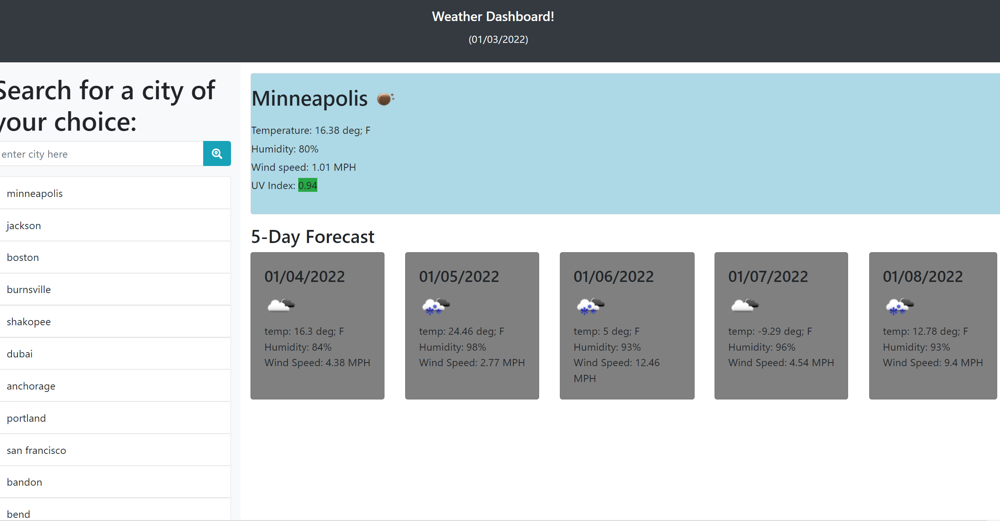

Weather Dashbaord Homework 6
============

[deployed page](https://skruphold.github.io/Weather-Dashboard-H6/)

Purpose of website!
============

The purpose of this website is to be able to show the current weather conditons for the day of plus the 5 day forecast of any city that the user decides to enter. It is able to display the current temp, humidity, wind speed, uv index, and an Icon that matches the weather. It is also to show you green if uv index is good orange if it needs to be a warning and red if its terrible. It also displays a background color for most icons blue for clear light grey for partly cloudy and dark grey for overcast. 

Experience building the website!
============

I started with of course building the html. I used bootstrap to make it alot easier and made ure to add Id's to everything for calling on them in javaScript. I also decided to use jQuery for suger coating the javaScript. Once I had my html assembled I went right into making my javascript variables and made an event listener for if the search button is clicked. I also did this for if someone pressed enter but I did'nt even think of that till much later. Then I wrote a huge function for getting weather conditons and supplied it with 3 ajax API calls. I also created the boxes that would hold the 5 day for cast in javascript and appended and prepended from there. At this point I decided to add a css file. With some basic classes that I use in javaScript mostly. Then I had to right a function to keep track of the cities that have been searched which I decided to place cities into an array which calls on a function to list them in my search history area and a conditon if it's a city already stored then remove it form bottom and place at top. Then I wrote a function to store them to the local storage so they'd remain in the list even after refreshing. Then I had to write a an event listener on to each of the items in the list to call on them and repopulate that cities weather. I had to go back into css after this function and add a cursor and hover to the city button.